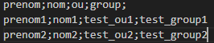

:doctype: book
= Script AD
:source-highlighter: highlight.js
:sectums:
:toc: left
:toc-title: Système et réseau Mémo
:toclevels: 4

Ce script permet d'automatiser la création d'un Active Directory fonctionnel et securisé.

== Prérequis
* 2 Windows Server AD
* 2 Windows Server pour serveur de fichiers
* Les vms peuvent communiquer

== Script

Suivre l'ordre pour l'installation d'un AD.

=== Préparation CSV

* Le fichier csv doit être un fichier.csv en encodate UTF-8
* Avec un sommaire de ce type séparé par des ; + 

=== Description Script
* Menu1 = Création des OU en fonction du CSV + OU IMPRIMANTES,GROUPES,UTILISATEURS,ORDINATEURS,SERVEURS

* Menu2 = Création des groupes GDL,GU,GG (Groupe domain local,Group Universel,Groupe Global) en fonction des group du csv.

* Menu3 = Création des dossiers de partages PERSO et SERVICES en fonction du csv sur le serveur de fichier 1. + 
Les dossiers perso se nomment "prenom.nom".

* Menu4 = Création des utilisateurs en fonction du csv.

* Menu5= ACL sur les dossiers perso de chaque utilisateurs + ajout des utilisateurs a leurs Groupe Globale respectif.

* Menu6 = ACL sur les dossiers de services avec les groupes GDL respectif.
